## Analysis Results

Similarity values by metric can be found in the following files:

* cnn: `results\similarity\20260416-181811\20260115-181800_resnet.csv`
* edge: `results\similarity\20260416-181811\20260416-181835_edgeDen.csv`
* texture: `results\similarity\20260416-181811\20260416-181819_textComp.csv`
* entropy: `results\similarity\20260416-181811\20260416-181811_histEnt.csv`
* frequency: `results\similarity\20260416-181811\20260416-181934_fourFreq.csv`
* superpixel: `results\similarity\20260416-181811\20260416-181917_noOfSup.csv`

### CORRELATION ANALYSIS

Metrics not properly indexed:
* [UNKNOWN INDEX LABEL] '80.jpg_bright'
* [UNKNOWN COLUMN LABEL] '80.jpg_bright'

#### MEAN MCC: Correlation with Resnet Embedding

Overall:

* Pearson: 0.15282738031592208  (p = 8.447183043127579e-09 )
* Spearman: 0.22038928333239893  (p = 6.298218730861326e-17 )

Analysis for Bin Size: [-1.0;0.5[, [0.5;0.7[, [0.7;1.0]:

| Similarity Category | Correlation Type | Correlation Value | P-Value | 
|---|---|---|---| 
| Low (s < 0.5) | Pearson | 0.0893 | 0.00188 | 
| Low (s < 0.5) | Spearman | 0.1551 | 6.01e-08 | 
| Medium (0.5 ≤ s < 0.7) | Pearson | -0.0861 | 0.3500 | 
| Medium (0.5 ≤ s < 0.7) | Spearman | -0.0426 | 0.6440 | 
| High (0.7 ≤ s ≤ 1.0) | Pearson | 0.2918 | 0.00953 | 
| High (0.7 ≤ s ≤ 1.0) | Spearman | 0.2745 | 0.01500 |

Analysis for Bin Size 0.2:

| Similarity Range | Correlation Type | Correlation Value | P-Value | 
|---|---|---|---| 
| (-0.001, 0.2] | Pearson | -0.004 | 0.92790 | 
| (-0.001, 0.2] | Spearman | 0.034 | 0.48838 | 
| (0.2, 0.4] | Pearson | -0.011 | 0.78250 | 
| (0.2, 0.4] | Spearman | 0.048 | 0.20826 | 
| (0.4, 0.6] | Pearson | 0.018 | 0.80630 | 
| (0.4, 0.6] | Spearman | 0.024 | 0.73499 | 
| (0.6, 0.8] | Pearson | 0.193 | 0.18832 | 
| (0.6, 0.8] | Spearman | 0.191 | 0.19303 | 
| (0.8, 1.0] | Pearson | 0.292 | 0.01937 | 
| (0.8, 1.0] | Spearman | 0.315 | 0.01117 |

Analysis for Bin Size: 0.1:

| Bin            | Pearson Corr | Pearson p-value | Spearman Corr | Spearman p-value |
|----------------|--------------|-----------------|---------------|------------------|
| (-0.001, 0.1]  | -0.108       | 0.58580         | -0.091        | 0.64665          |
| (0.1, 0.2]     | -0.077       | 0.12664         | -0.070        | 0.16629          |
| (0.2, 0.3]     | 0.151        | 0.00106         | 0.168         | 0.00027          |
| (0.3, 0.4]     | -0.026       | 0.71141         | -0.015        | 0.83341          |
| (0.4, 0.5]     | -0.029       | 0.75965         | 0.035         | 0.71322          |
| (0.5, 0.6]     | -0.083       | 0.45155         | -0.114        | 0.30179          |
| (0.6, 0.7]     | 0.072        | 0.67673         | 0.064         | 0.70893          |
| (0.7, 0.8]     | 0.112        | 0.72810         | -0.057        | 0.86145          |
| (0.8, 0.9]     | -0.171       | 0.35053         | -0.008        | 0.96657          |
| (0.9, 1.0]     | 0.405        | 0.02141         | 0.366         | 0.03950          |

#### Resnet Transfer Rate

Metrics not properly indexed:
* [UNKNOWN INDEX LABEL] '80.jpg_bright'
* [UNKNOWN COLUMN LABEL] '80.jpg_bright'

Overview:
* Pipelines total: 38
* Pipelines by transfer_rate > 0.5: 32

Top Pipelines by `Mean Cross Score`:

| Source                          | Mean Cross Score | Transfer Rate | Combined Score |
|----------------------------------|------------------|----------------|----------------|
| MVTec_AD_Wood_Scratch           | 0.108823         | 0.918919       | 0.099999       |
| MVTec_AD_Bottle_Broken_Sm       | 0.104860         | 0.837838       | 0.087856       |
| MVTec_AD_Hazelnut_Crack         | 0.084178         | 0.972973       | 0.081903       |
| MVTec_AD_Metal_Nut              | 0.079351         | 0.729730       | 0.057905       |
| severstal-steel                 | 0.077334         | 0.783784       | 0.060613       |
| MVTec_AD_Tile_Crack             | 0.073861         | 0.540541       | 0.039925       |
| MVTec_AD_Pill_Crack             | 0.069799         | 0.837838       | 0.058481       |
| AirCarbon3_80.jpg_bright        | 0.066951         | 0.891892       | 0.059713       |
| MVTec_AD_Zipper_Rough           | 0.063903         | 0.675676       | 0.043178       |
| MAIPreform2_Spule0_0816_Upside  | 0.061231         | 0.675676       | 0.041372       |

Top Pipelines by Combined Score (`Mean × Transfer Rate`):

| Source                         | Mean Cross Score | Transfer Rate | Combined Score |
|--------------------------------|------------------|----------------|----------------|
| MVTec_AD_Wood_Scratch          | 0.108823         | 0.918919       | 0.099999       |
| MVTec_AD_Bottle_Broken_Sm      | 0.104860         | 0.837838       | 0.087856       |
| MVTec_AD_Hazelnut_Crack        | 0.084178         | 0.972973       | 0.081903       |
| severstal-steel                | 0.077334         | 0.783784       | 0.060613       |
| AirCarbon3_80.jpg_bright       | 0.066951         | 0.891892       | 0.059713       |
| MVTec_AD_Pill_Crack            | 0.069799         | 0.837838       | 0.058481       |
| MVTec_AD_Metal_Nut             | 0.079351         | 0.729730       | 0.057905       |
| AirCarbon3_80.jpg_dark_3       | 0.055090         | 0.891892       | 0.049134       |
| AirCarbon3_80.jpg_dark_5       | 0.054834         | 0.837838       | 0.045942       |
| Pultrusion_Window              | 0.046199         | 0.972973       | 0.044950       |

---

#### MEAN MCC: Correlation with Histogram Entropy

Overall:

* **Pearson:** 0.06823923059577064  (p = 0.010483741878230661 )
* **Spearman:** 0.10460217197555477  (p = 8.511266866131907e-05 )

Analysis for Bin Size [-1.0; 0.5[, [0.5; 0.7[, [0.7; 1.0]:

| Similarity Category                  | Correlation Type | Correlation Value | P-Value |
|------------------------------------|------------------|-------------------|---------|
| Low Similarity (s < 0.5)           | Pearson          | NaN               | NaN     |
| Low Similarity (s < 0.5)           | Spearman         | NaN               | NaN     |
| Medium Similarity (0.5 ≤ s < 0.7)  | Pearson          | 0.235729          | 0.106755|
| Medium Similarity (0.5 ≤ s < 0.7)  | Spearman         | 0.132623          | 0.368867|
| High Similarity (0.7 ≤ s ≤ 1.0)    | Pearson          | 0.062400          | 0.021470|
| High Similarity (0.7 ≤ s ≤ 1.0)    | Spearman         | 0.103032          | 0.000143|

Analysis for Bin Size 0.2:

| Bin            | Pearson Corr | Pearson p-value | Spearman Corr | Spearman p-value |
|----------------|--------------|-----------------|---------------|------------------|
| (0.4, 0.6]     | -0.381       | 0.45658         | -0.359        | 0.48520          |
| (0.6, 0.8]     | 0.065        | 0.47551         | -0.007        | 0.93672          |
| (0.8, 1.0]     | 0.050        | 0.07209         | 0.096         | 0.00058          |

Analysis for Bin Size 0.1:

| Bin            | Pearson Corr | Pearson p-value | Spearman Corr | Spearman p-value |
|----------------|--------------|-----------------|---------------|------------------|
| (0.5, 0.6]     | -0.381       | 0.45658         | -0.359        | 0.48520          |
| (0.6, 0.7]     | 0.168        | 0.28899         | 0.072         | 0.64941          |
| (0.7, 0.8]     | 0.088        | 0.43103         | 0.038         | 0.73246          |
| (0.8, 0.9]     | -0.096       | 0.20546         | -0.105        | 0.16724          |
| (0.9, 1.0]     | 0.036        | 0.23284         | 0.092         | 0.00236          |

#### Histogram Entropy Transfer Score

Overview:
* Pipelines total: 38
* Pipelines by transfer_rate > 0.5: 32

Top Pipelines by `Mean Cross Score`:

| Source                          | Mean Cross Score | Transfer Rate | Combined Score |
|----------------------------------|------------------|----------------|----------------|
| MVTec_AD_Wood_Scratch           | 0.108823         | 0.918919       | 0.099999       |
| MVTec_AD_Bottle_Broken_Sm       | 0.104860         | 0.837838       | 0.087856       |
| MVTec_AD_Hazelnut_Crack         | 0.084178         | 0.972973       | 0.081903       |
| MVTec_AD_Metal_Nut              | 0.079351         | 0.729730       | 0.057905       |
| severstal-steel                 | 0.077334         | 0.783784       | 0.060613       |
| MVTec_AD_Tile_Crack             | 0.073861         | 0.540541       | 0.039925       |
| MVTec_AD_Pill_Crack             | 0.069799         | 0.837838       | 0.058481       |
| AirCarbon3_80.jpg_bright        | 0.066951         | 0.891892       | 0.059713       |
| MVTec_AD_Zipper_Rough           | 0.063903         | 0.675676       | 0.043178       |
| MAIPreform2_Spule0_0816_Upside  | 0.061231         | 0.675676       | 0.041372       |

Top Pipelines by Combined Score (`Mean × Transfer Rate`):

| Source                         | Mean Cross Score | Transfer Rate | Combined Score |
|--------------------------------|------------------|----------------|----------------|
| MVTec_AD_Wood_Scratch          | 0.108823         | 0.918919       | 0.099999       |
| MVTec_AD_Bottle_Broken_Sm      | 0.104860         | 0.837838       | 0.087856       |
| MVTec_AD_Hazelnut_Crack        | 0.084178         | 0.972973       | 0.081903       |
| severstal-steel                | 0.077334         | 0.783784       | 0.060613       |
| AirCarbon3_80.jpg_bright       | 0.066951         | 0.891892       | 0.059713       |
| MVTec_AD_Pill_Crack            | 0.069799         | 0.837838       | 0.058481       |
| MVTec_AD_Metal_Nut             | 0.079351         | 0.729730       | 0.057905       |
| AirCarbon3_80.jpg_dark_3       | 0.055090         | 0.891892       | 0.049134       |
| AirCarbon3_80.jpg_dark_5       | 0.054834         | 0.837838       | 0.045942       |
| Pultrusion_Window              | 0.046199         | 0.972973       | 0.044950       |

--- 

#### MEAN MCC: Correlation with Texture Feature Similarity

Overall:
* **Pearson:** 0.08021004573100962  (p = 0.00261432922281734 )
* **Spearman:** 0.09500367853289078  (p = 0.0003607832953031716 )

Analysis for Bin Size: [-1.0;0.5[, [0.5;0.7[, [0.7;1.0]:

| Similarity Category                  | Correlation Type | Correlation Value | P-Value |
|------------------------------------|------------------|-------------------|---------|
| Low Similarity (s < 0.5)           | Pearson          | NaN               | NaN     |
| Low Similarity (s < 0.5)           | Spearman         | NaN               | NaN     |
| Medium Similarity (0.5 <= s < 0.7) | Pearson          | 0.215369          | 0.141534|
| Medium Similarity (0.5 <= s < 0.7) | Spearman         | 0.128444          | 0.384278|
| High Similarity (0.7 <= s <= 1.0)  | Pearson          | 0.073658          | 0.006616|
| High Similarity (0.7 <= s <= 1.0)  | Spearman         | 0.084262          | 0.001885|

Analysis for Bin Size 0.2:

| Bin            | Pearson Corr | Pearson p-value | Spearman Corr | Spearman p-value |
|----------------|--------------|-----------------|---------------|------------------|
| (0.4, 0.6]     | -0.091       | 0.68562         | -0.046        | 0.84041          |
| (0.6, 0.8]     | -0.114       | 0.47176         | -0.078        | 0.62441          |
| (0.8, 1.0]     | 0.059        | 0.02959         | 0.075         | 0.00588          |

Analysis for Bin Size 0.1:

| Bin            | Pearson Corr | Pearson p-value | Spearman Corr | Spearman p-value |
|----------------|--------------|-----------------|---------------|------------------|
| (0.5, 0.6]     | -0.091       | 0.68562         | -0.046        | 0.84041          |
| (0.6, 0.7]     | 0.154        | 0.45172         | 0.211         | 0.30125          |
| (0.7, 0.8]     | 0.324        | 0.22088         | 0.228         | 0.39576          |
| (0.8, 0.9]     | -0.170       | 0.01867         | -0.087        | 0.23218          |
| (0.9, 1.0]     | 0.021        | 0.48548         | 0.035         | 0.23895          |

#### Texture Feature Similarity - Transfer Score

Overview:
* Pipelines total: 38
* Pipelines by transfer_rate > 0.5: 32

Top pipelines by `mean_cross_score`:

| Source                          | Mean Cross Score | Transfer Rate | Combined Score |
|----------------------------------|------------------|----------------|----------------|
| MVTec_AD_Wood_Scratch           | 0.108823         | 0.918919       | 0.099999       |
| MVTec_AD_Bottle_Broken_Sm       | 0.104860         | 0.837838       | 0.087856       |
| MVTec_AD_Hazelnut_Crack         | 0.084178         | 0.972973       | 0.081903       |
| MVTec_AD_Metal_Nut              | 0.079351         | 0.729730       | 0.057905       |
| severstal-steel                 | 0.077334         | 0.783784       | 0.060613       |
| MVTec_AD_Tile_Crack             | 0.073861         | 0.540541       | 0.039925       |
| MVTec_AD_Pill_Crack             | 0.069799         | 0.837838       | 0.058481       |
| AirCarbon3_80.jpg_bright        | 0.066951         | 0.891892       | 0.059713       |
| MVTec_AD_Zipper_Rough           | 0.063903         | 0.675676       | 0.043178       |
| MAIPreform2_Spule0_0816_Upside  | 0.061231         | 0.675676       | 0.041372       |

Top pipelines by combined_score (`mean * transfer_rate`):

| Source                         | Mean Cross Score | Transfer Rate | Combined Score |
|--------------------------------|------------------|----------------|----------------|
| MVTec_AD_Wood_Scratch          | 0.108823         | 0.918919       | 0.099999       |
| MVTec_AD_Bottle_Broken_Sm      | 0.104860         | 0.837838       | 0.087856       |
| MVTec_AD_Hazelnut_Crack        | 0.084178         | 0.972973       | 0.081903       |
| severstal-steel                | 0.077334         | 0.783784       | 0.060613       |
| AirCarbon3_80.jpg_bright       | 0.066951         | 0.891892       | 0.059713       |
| MVTec_AD_Pill_Crack            | 0.069799         | 0.837838       | 0.058481       |
| MVTec_AD_Metal_Nut             | 0.079351         | 0.729730       | 0.057905       |
| AirCarbon3_80.jpg_dark_3       | 0.055090         | 0.891892       | 0.049134       |
| AirCarbon3_80.jpg_dark_5       | 0.054834         | 0.837838       | 0.045942       |
| Pultrusion_Window              | 0.046199         | 0.972973       | 0.044950       |

---

#### MEAN MCC: Correlation with Edge Density

Overall:
* **Pearson:** 0.11190361790239738  (p = 2.6051065199340947e-05 )
* **Spearman:** 0.15102788207552206  (p = 1.265373246855991e-08 )

Analysis for Bin Size: [-1.0;0.5[, [0.5;0.7[, [0.7;1.0]:

* Not enough data for correlation is labelled: `nan`

| Similarity Category                  | Correlation Type | Correlation Value | P-Value |
|------------------------------------|------------------|-------------------|---------|
| Low Similarity (s < 0.5)           | Pearson          | NaN               | NaN     |
| Low Similarity (s < 0.5)           | Spearman         | NaN               | NaN     |
| Medium Similarity (0.5 <= s < 0.7) | Pearson          | -0.017474         | 0.929675|
| Medium Similarity (0.5 <= s < 0.7) | Spearman         | 0.111934          | 0.570658|
| High Similarity (0.7 <= s <= 1.0)  | Pearson          | 0.115327          | 0.000018|
| High Similarity (0.7 <= s <= 1.0)  | Spearman         | 0.152696          | 0.000000|

Analysis for Bin Size 0.2:

| Bin            | Pearson Corr | Pearson p-value | Spearman Corr | Spearman p-value |
|----------------|--------------|-----------------|---------------|------------------|
| (0.6, 0.8]     | -0.048       | 0.47420         | 0.022         | 0.74113          |
| (0.8, 1.0]     | 0.117        | 0.00006         | 0.146         | 0.00000          |

Analysis for Bin Size 0.1:

| Bin            | Pearson Corr | Pearson p-value | Spearman Corr | Spearman p-value |
|----------------|--------------|-----------------|---------------|------------------|
| (0.6, 0.7]     | -0.017       | 0.92967         | 0.112         | 0.57066          |
| (0.7, 0.8]     | -0.038       | 0.59112         | 0.036         | 0.61347          |
| (0.8, 0.9]     | 0.143        | 0.00584         | 0.171         | 0.00097          |
| (0.9, 1.0]     | 0.114        | 0.00122         | 0.090         | 0.01006          |

#### Edge Density Transfer Score

Overview:
* Pipelines total: 38
* Pipelines by transfer_rate > 0.5: 32

Top pipelines by `mean_cross_score`:

| Source                          | Mean Cross Score | Transfer Rate | Combined Score |
|----------------------------------|------------------|----------------|----------------|
| MVTec_AD_Wood_Scratch           | 0.108823         | 0.918919       | 0.099999       |
| MVTec_AD_Bottle_Broken_Sm       | 0.104860         | 0.837838       | 0.087856       |
| MVTec_AD_Hazelnut_Crack         | 0.084178         | 0.972973       | 0.081903       |
| MVTec_AD_Metal_Nut              | 0.079351         | 0.729730       | 0.057905       |
| severstal-steel                 | 0.077334         | 0.783784       | 0.060613       |
| MVTec_AD_Tile_Crack             | 0.073861         | 0.540541       | 0.039925       |
| MVTec_AD_Pill_Crack             | 0.069799         | 0.837838       | 0.058481       |
| AirCarbon3_80.jpg_bright        | 0.066951         | 0.891892       | 0.059713       |
| MVTec_AD_Zipper_Rough           | 0.063903         | 0.675676       | 0.043178       |
| MAIPreform2_Spule0_0816_Upside  | 0.061231         | 0.675676       | 0.041372       |

---

Top pipelines by combined_score (`mean * transfer_rate`):

| Source                         | Mean Cross Score | Transfer Rate | Combined Score |
|--------------------------------|------------------|----------------|----------------|
| MVTec_AD_Wood_Scratch          | 0.108823         | 0.918919       | 0.099999       |
| MVTec_AD_Bottle_Broken_Sm      | 0.104860         | 0.837838       | 0.087856       |
| MVTec_AD_Hazelnut_Crack        | 0.084178         | 0.972973       | 0.081903       |
| severstal-steel                | 0.077334         | 0.783784       | 0.060613       |
| AirCarbon3_80.jpg_bright       | 0.066951         | 0.891892       | 0.059713       |
| MVTec_AD_Pill_Crack            | 0.069799         | 0.837838       | 0.058481       |
| MVTec_AD_Metal_Nut             | 0.079351         | 0.729730       | 0.057905       |
| AirCarbon3_80.jpg_dark_3       | 0.055090         | 0.891892       | 0.049134       |
| AirCarbon3_80.jpg_dark_5       | 0.054834         | 0.837838       | 0.045942       |
| Pultrusion_Window              | 0.046199         | 0.972973       | 0.044950       |

---

#### MEAN MCC: Correlation with Number of Superpixels

Overall:
* **Pearson**: 0.03717033308846598  (p = 0.16361817764147576 )
* **Spearman**: 0.048021822286472574  (p = 0.0718455932861254 )
Analysis for Bin Size: [-1.0;0.5[, [0.5;0.7[, [0.7;1.0]:

| Similarity Category                  | Correlation Type | Correlation Value | P-Value | Notes                              |
|------------------------------------|------------------|-------------------|---------|------------------------------------|
| Low Similarity (s < 0.5)           | Pearson          | NaN               | NaN     | Not enough data (n=0)              |
| Low Similarity (s < 0.5)           | Spearman         | NaN               | NaN     | Not enough data (n=0)              |
| Medium Similarity (0.5 <= s < 0.7) | Pearson          | NaN               | NaN     | Constant input / undefined         |
| Medium Similarity (0.5 <= s < 0.7) | Spearman         | NaN               | NaN     | Constant input / undefined         |
| High Similarity (0.7 <= s <= 1.0)  | Pearson          | 0.035703          | 0.181219| —                                  |
| High Similarity (0.7 <= s <= 1.0)  | Spearman         | 0.046988          | 0.078402| —                                  |

Analysis for Bin Size 0.2:

| Bin            | Pearson Corr | Pearson p-value | Spearman Corr | Spearman p-value | Notes |
|----------------|--------------|-----------------|---------------|------------------|-------|
| (0.6, 0.8]     | -0.016       | 0.91799         | -0.038        | 0.80439          | —     |
| (0.8, 1.0]     | 0.030        | 0.26252         | 0.043         | 0.10936          | —     |

Analysis for Bin Size 0.1:

| Bin            | Pearson Corr | Pearson p-value | Spearman Corr | Spearman p-value | Notes                              |
|----------------|--------------|-----------------|---------------|------------------|------------------------------------|
| (0.6, 0.7]     | NaN          | NaN             | NaN           | NaN              | Constant input (no variance)       |
| (0.7, 0.8]     | -0.053       | 0.73104         | -0.054        | 0.72819          | —                                  |
| (0.8, 0.9]     | 0.038        | 0.67876         | -0.028        | 0.75841          | —                                  |
| (0.9, 1.0]     | 0.006        | 0.83663         | 0.033         | 0.24849          | —                                  |

Notes:
- **NaN values** occur due to:
  - Insufficient data (e.g., n = 0)
  - Constant input arrays (no variance → correlation undefined)
- A **FutureWarning** regarding `observed=False` in pandas was omitted as it does not affect results.

#### Number of Superpixels Transfer Score

Overview:
* Pipelines total: 38
* Pipelines by transfer_rate > 0.5: 32

Top pipelines by `mean_cross_score`:

| Source                          | Mean Cross Score | Transfer Rate | Combined Score |
|----------------------------------|------------------|----------------|----------------|
| MVTec_AD_Wood_Scratch           | 0.108823         | 0.918919       | 0.099999       |
| MVTec_AD_Bottle_Broken_Sm       | 0.104860         | 0.837838       | 0.087856       |
| MVTec_AD_Hazelnut_Crack         | 0.084178         | 0.972973       | 0.081903       |
| MVTec_AD_Metal_Nut              | 0.079351         | 0.729730       | 0.057905       |
| severstal-steel                 | 0.077334         | 0.783784       | 0.060613       |
| MVTec_AD_Tile_Crack             | 0.073861         | 0.540541       | 0.039925       |
| MVTec_AD_Pill_Crack             | 0.069799         | 0.837838       | 0.058481       |
| AirCarbon3_80.jpg_bright        | 0.066951         | 0.891892       | 0.059713       |
| MVTec_AD_Zipper_Rough           | 0.063903         | 0.675676       | 0.043178       |
| MAIPreform2_Spule0_0816_Upside  | 0.061231         | 0.675676       | 0.041372       |

Top pipelines by combined_score (`mean * transfer_rate`):

| Source                         | Mean Cross Score | Transfer Rate | Combined Score |
|--------------------------------|------------------|----------------|----------------|
| MVTec_AD_Wood_Scratch          | 0.108823         | 0.918919       | 0.099999       |
| MVTec_AD_Bottle_Broken_Sm      | 0.104860         | 0.837838       | 0.087856       |
| MVTec_AD_Hazelnut_Crack        | 0.084178         | 0.972973       | 0.081903       |
| severstal-steel                | 0.077334         | 0.783784       | 0.060613       |
| AirCarbon3_80.jpg_bright       | 0.066951         | 0.891892       | 0.059713       |
| MVTec_AD_Pill_Crack            | 0.069799         | 0.837838       | 0.058481       |
| MVTec_AD_Metal_Nut             | 0.079351         | 0.729730       | 0.057905       |
| AirCarbon3_80.jpg_dark_3       | 0.055090         | 0.891892       | 0.049134       |
| AirCarbon3_80.jpg_dark_5       | 0.054834         | 0.837838       | 0.045942       |
| Pultrusion_Window              | 0.046199         | 0.972973       | 0.044950       |

---

#### MEAN MCC: Correlation with Fourier Frequency

Overall:
* **Pearson**: 0.077177615831682  (p = 0.003783752031261387 )
* **Spearman**: 0.07893875100382414  (p = 0.00305716984658079 )

Analysis for Bin Size: [-1.0;0.5[, [0.5;0.7[, [0.7;1.0]:

| Similarity Category                  | Correlation Type | Correlation Value | P-Value |
|------------------------------------|------------------|-------------------|---------|
| Low Similarity (s < 0.5)           | Pearson          | NaN               | NaN     |
| Low Similarity (s < 0.5)           | Spearman         | NaN               | NaN     |
| Medium Similarity (0.5 <= s < 0.7) | Pearson          | 0.079562          | 0.293879|
| Medium Similarity (0.5 <= s < 0.7) | Spearman         | 0.016466          | 0.828280|
| High Similarity (0.7 <= s <= 1.0)  | Pearson          | 0.035678          | 0.211150|
| High Similarity (0.7 <= s <= 1.0)  | Spearman         | 0.060420          | 0.034108|

Analysis for Bin Size 0.2:

| Bin            | Pearson Corr | Pearson p-value | Spearman Corr | Spearman p-value |
|----------------|--------------|-----------------|---------------|------------------|
| (0.4, 0.6]     | 0.127        | 0.41303         | 0.023         | 0.88437          |
| (0.6, 0.8]     | 0.088        | 0.15811         | 0.013         | 0.83127          |
| (0.8, 1.0]     | 0.040        | 0.18602         | 0.050         | 0.09862          |

Analysis for Bin Size 0.1:

| Bin            | Pearson Corr | Pearson p-value | Spearman Corr | Spearman p-value |
|----------------|--------------|-----------------|---------------|------------------|
| (0.5, 0.6]     | 0.127        | 0.41303         | 0.023         | 0.88437          |
| (0.6, 0.7]     | -0.011       | 0.90365         | -0.021        | 0.80910          |
| (0.7, 0.8]     | -0.027       | 0.76068         | 0.061         | 0.49444          |
| (0.8, 0.9]     | 0.089        | 0.45868         | 0.104         | 0.38406          |
| (0.9, 1.0]     | 0.004        | 0.88901         | 0.025         | 0.41550          |

#### Fourier Frequency Transfer Score

Overview:
* Pipelines total: 38
* Pipelines by transfer_rate > 0.5: 32

Top pipelines by `mean_cross_score`:

| Source                          | Mean Cross Score | Transfer Rate | Combined Score |
|----------------------------------|------------------|----------------|----------------|
| MVTec_AD_Wood_Scratch           | 0.108823         | 0.918919       | 0.099999       |
| MVTec_AD_Bottle_Broken_Sm       | 0.104860         | 0.837838       | 0.087856       |
| MVTec_AD_Hazelnut_Crack         | 0.084178         | 0.972973       | 0.081903       |
| MVTec_AD_Metal_Nut              | 0.079351         | 0.729730       | 0.057905       |
| severstal-steel                 | 0.077334         | 0.783784       | 0.060613       |
| MVTec_AD_Tile_Crack             | 0.073861         | 0.540541       | 0.039925       |
| MVTec_AD_Pill_Crack             | 0.069799         | 0.837838       | 0.058481       |
| AirCarbon3_80.jpg_bright        | 0.066951         | 0.891892       | 0.059713       |
| MVTec_AD_Zipper_Rough           | 0.063903         | 0.675676       | 0.043178       |
| MAIPreform2_Spule0_0816_Upside  | 0.061231         | 0.675676       | 0.041372       |

Top pipelines by combined_score (`mean * transfer_rate`):

| Source                         | Mean Cross Score | Transfer Rate | Combined Score |
|--------------------------------|------------------|----------------|----------------|
| MVTec_AD_Wood_Scratch          | 0.108823         | 0.918919       | 0.099999       |
| MVTec_AD_Bottle_Broken_Sm      | 0.104860         | 0.837838       | 0.087856       |
| MVTec_AD_Hazelnut_Crack        | 0.084178         | 0.972973       | 0.081903       |
| severstal-steel                | 0.077334         | 0.783784       | 0.060613       |
| AirCarbon3_80.jpg_bright       | 0.066951         | 0.891892       | 0.059713       |
| MVTec_AD_Pill_Crack            | 0.069799         | 0.837838       | 0.058481       |
| MVTec_AD_Metal_Nut             | 0.079351         | 0.729730       | 0.057905       |
| AirCarbon3_80.jpg_dark_3       | 0.055090         | 0.891892       | 0.049134       |
| AirCarbon3_80.jpg_dark_5       | 0.054834         | 0.837838       | 0.045942       |
| Pultrusion_Window              | 0.046199         | 0.972973       | 0.044950       |

### Mean MCC: Pipeline Performance & Feature Impact

Top pipelines (by mean_cross_score with additional stats):

| Source                         | Mean Cross Score | Count Targets | Combined Score |
|--------------------------------|------------------|---------------|----------------|
| MVTec_AD_Wood_Scratch          | 0.108823         | 37            | 0.066902       |
| MVTec_AD_Hazelnut_Crack        | 0.084178         | 37            | 0.053941       |
| MVTec_AD_Bottle_Broken_Sm      | 0.104860         | 37            | 0.045581       |
| AirCarbon3_80.jpg_bright       | 0.066951         | 37            | 0.040677       |
| severstal-steel                | 0.077334         | 37            | 0.033825       |

Metric performance summary (regression / explanatory power):

| Metric      | n_obs | R²       | p-value      | AIC          | BIC          |
|-------------|-------|----------|--------------|--------------|--------------|
| cnn         | 1406  | 0.023356 | 8.45e-09     | -2010.452246 | -1999.955238 |
| entropy     | 1406  | 0.012522 | 2.61e-05     | -1994.941533 | -1984.444525 |
| texture     | 1406  | 0.006434 | 2.61e-03     | -1986.298782 | -1975.801773 |
| superpixel  | 1406  | 0.005956 | 3.78e-03     | -1985.623561 | -1975.126553 |
| edge        | 1406  | 0.004657 | 1.05e-02     | -1983.786304 | -1973.289296 |
| frequency   | 1406  | 0.001382 | 1.64e-01     | -1979.167764 | -1968.670756 |

#### Mean MCC: OLS Linear Regression

OLS Regression Results:

| Metric                | Value        |
|----------------------|-------------|
| Dep. Variable        | cross_score |
| Model                | OLS         |
| Method               | Least Squares |
| No. Observations     | 1406        |
| Df Residuals         | 1398        |
| Df Model             | 7           |
| R-squared            | 0.040       |
| Adj. R-squared       | 0.035       |
| F-statistic          | 8.378       |
| Prob (F-statistic)   | 4.64e-10    |
| Log-Likelihood       | 1019.5      |
| AIC                  | -2023       |
| BIC                  | -1981       |
| Covariance Type      | nonrobust   |

| Variable        | Coef   | Std Err | t      | P > abs(t) | 0.025  | 0.975 |
|-----------------|--------|---------|--------|------------|--------|--------|
| const           | 0.0428 | 0.003   | 13.655 | 0.000      | 0.037  | 0.049  |
| cnn             | 0.0154 | 0.003   | 4.635  | 0.000      | 0.009  | 0.022  |
| edge            | 0.0043 | 0.004   | 0.998  | 0.319      | -0.004 | 0.013  |
| texture         | 0.0021 | 0.004   | 0.513  | 0.608      | -0.006 | 0.010  |
| entropy         | 0.0132 | 0.004   | 3.562  | 0.000      | 0.006  | 0.021  |
| frequency       | -0.0062| 0.004   | -1.413 | 0.158      | -0.015 | 0.002  |
| superpixel      | 0.0077 | 0.004   | 1.891  | 0.059      | -0.000 | 0.016  |
| original_score  | -0.0048| 0.003   | -1.452 | 0.147      | -0.011 | 0.002  |

| Diagnostic Metric | Value    |
|-------------------|----------|
| Omnibus           | 306.629  |
| Prob(Omnibus)     | 0.000    |
| Jarque-Bera (JB)  | 10642.823|
| Prob(JB)          | 0.00     |
| Skew              | 0.161    |
| Kurtosis          | 16.475   |
| Durbin-Watson     | 1.755    |
| Cond. No.         | 2.95     |

Notes:
- Standard Errors assume that the covariance matrix of the errors is correctly specified.

---

Logit Regression Results:

| Metric                | Value        |
|----------------------|-------------|
| Dep. Variable        | good_transfer |
| Model                | Logit        |
| Method               | MLE          |
| No. Observations     | 1406         |
| Df Residuals         | 1398         |
| Df Model             | 7            |
| Pseudo R-squared     | 0.07429      |
| Log-Likelihood       | -808.83      |
| LL-Null              | -873.74      |
| LLR p-value          | 6.855e-25    |
| Converged            | True         |
| Covariance Type      | nonrobust    |

| Variable        | Coef    | Std Err | z      | P > abs(t) | 0.025  | 0.975  |
|-----------------|---------|---------|--------|------|--------|--------|
| const           | -0.8783 | 0.063   | -14.005| 0.000| -1.001 | -0.755 |
| cnn             | 0.2895  | 0.063   | 4.611  | 0.000| 0.166  | 0.412  |
| edge            | 0.2182  | 0.098   | 2.224  | 0.026| 0.026  | 0.410  |
| texture         | 0.1522  | 0.095   | 1.607  | 0.108| -0.033 | 0.338  |
| entropy         | 0.3851  | 0.077   | 5.013  | 0.000| 0.235  | 0.536  |
| frequency       | -0.1392 | 0.095   | -1.472 | 0.141| -0.324 | 0.046  |
| superpixel      | 0.2835  | 0.087   | 3.256  | 0.001| 0.113  | 0.454  |
| original_score  | -0.1560 | 0.064   | -2.424 | 0.015| -0.282 | -0.030 |

---

---

#### BEST MCC: Correlation with Resnet Embedding

Overall:
* **Pearson**: 0.12375453331489811  (p = 3.2530982029878423e-06 )
* **Spearman**: 0.15404967578565698  (p = 6.402088894866122e-09 )

Analysis for Bin Size: [-1.0;0.5[, [0.5;0.7[, [0.7;1.0]:

| Similarity Category                  | Correlation Type | Correlation Value | P-Value |
|------------------------------------|------------------|-------------------|---------|
| Low Similarity (s < 0.5)           | Pearson          | 0.090556          | 0.001629|
| Low Similarity (s < 0.5)           | Spearman         | 0.106673          | 0.000204|
| Medium Similarity (0.5 <= s < 0.7) | Pearson          | 0.062516          | 0.497569|
| Medium Similarity (0.5 <= s < 0.7) | Spearman         | 0.045447          | 0.622092|
| High Similarity (0.7 <= s <= 1.0)  | Pearson          | 0.152555          | 0.182401|
| High Similarity (0.7 <= s <= 1.0)  | Spearman         | 0.196287          | 0.085002|

Analysis for Bin Size 0.2:

| Bin             | Pearson Corr | Pearson p-value | Spearman Corr | Spearman p-value |
|-----------------|--------------|-----------------|---------------|------------------|
| (-0.001, 0.2]   | 0.155        | 0.00148         | 0.154         | 0.00159          |
| (0.2, 0.4]      | 0.016        | 0.68145         | 0.038         | 0.31875          |
| (0.4, 0.6]      | -0.026       | 0.71727         | -0.003        | 0.96237          |
| (0.6, 0.8]      | 0.093        | 0.52810         | 0.201         | 0.16988          |
| (0.8, 1.0]      | 0.488        | 0.00004         | 0.438         | 0.00029          |

Analysis for Bin Size 0.1:

| Bin             | Pearson Corr | Pearson p-value | Spearman Corr | Spearman p-value |
|-----------------|--------------|-----------------|---------------|------------------|
| (-0.001, 0.1]   | 0.499        | 0.00684         | 0.057         | 0.77503          |
| (0.1, 0.2]      | 0.062        | 0.21948         | 0.060         | 0.24064          |
| (0.2, 0.3]      | 0.094        | 0.04243         | 0.105         | 0.02326          |
| (0.3, 0.4]      | 0.043        | 0.53822         | -0.009        | 0.90022          |
| (0.4, 0.5]      | 0.013        | 0.89384         | 0.058         | 0.54035          |
| (0.5, 0.6]      | -0.046       | 0.67771         | -0.073        | 0.51097          |
| (0.6, 0.7]      | -0.205       | 0.23131         | -0.066        | 0.70226          |
| (0.7, 0.8]      | -0.093       | 0.77281         | -0.297        | 0.34880          |
| (0.8, 0.9]      | 0.075        | 0.68426         | 0.228         | 0.20992          |
| (0.9, 1.0]      | 0.373        | 0.03569         | 0.340         | 0.05686          |

#### BEST Resnet Transfer Rate

Overview:
* Pipelines total: 38
* Pipelines by transfer_rate > 0.5: 33

Top pipelines by `mean_cross_score`:

| Source                         | Mean Cross Score | Transfer Rate | Combined Score |
|--------------------------------|------------------|----------------|----------------|
| AirCarbon3_80.jpg_dark_2       | 0.133486         | 0.864865       | 0.115448       |
| MVTec_AD_Wood_Scratch          | 0.125064         | 0.864865       | 0.108163       |
| MVTec_AD_Zipper_Rough          | 0.120984         | 0.891892       | 0.107905       |
| MVTec_AD_Capsule               | 0.113963         | 0.972973       | 0.110883       |
| MVTec_AD_Toothbrush_Sm         | 0.113285         | 0.972973       | 0.110223       |
| severstal-steel                | 0.109127         | 0.864865       | 0.094380       |
| AirCarbon3_80.jpg_dark_3       | 0.105951         | 0.891892       | 0.094497       |
| CF_ReferenceSet_Small_Light    | 0.101112         | 0.891892       | 0.090181       |
| MVTec_AD_Tile_Crack            | 0.098125         | 0.729730       | 0.071605       |
| MVTec_AD_Screw_Scratch         | 0.094959         | 0.891892       | 0.084693       |

Top pipelines by combined_score (`mean * transfer_rate`):

| Source                         | Mean Cross Score | Transfer Rate | Combined Score |
|--------------------------------|------------------|----------------|----------------|
| AirCarbon3_80.jpg_dark_2       | 0.133486         | 0.864865       | 0.115448       |
| MVTec_AD_Capsule               | 0.113963         | 0.972973       | 0.110883       |
| MVTec_AD_Toothbrush_Sm         | 0.113285         | 0.972973       | 0.110223       |
| MVTec_AD_Wood_Scratch          | 0.125064         | 0.864865       | 0.108163       |
| MVTec_AD_Zipper_Rough          | 0.120984         | 0.891892       | 0.107905       |
| AirCarbon3_80.jpg_dark_3       | 0.105951         | 0.891892       | 0.094497       |
| severstal-steel                | 0.109127         | 0.864865       | 0.094380       |
| CF_ReferenceSet_Small_Light    | 0.101112         | 0.891892       | 0.090181       |
| MVTec_AD_Screw_Scratch         | 0.094959         | 0.891892       | 0.084693       |
| MVTec_AD_Metal_Nut             | 0.087780         | 0.945946       | 0.083035       |

---

#### BEST MCC: Correlation with Histogram Entropy

Overall:
* **Pearson**: 0.11600498018368753  (p = 1.296703114201736e-05 )
* **Spearman**: 0.16659535990566782  (p = 3.274625281712733e-10 )

Analysis for Bin Size [-1.0;0.5[, [0.5;0.7[, [0.7;1.0]:

| Similarity Category                  | Correlation Type | Correlation Value | P-Value |
|------------------------------------|------------------|-------------------|---------|
| Low Similarity (s < 0.5)           | Pearson          | NaN               | NaN     |
| Low Similarity (s < 0.5)           | Spearman         | NaN               | NaN     |
| Medium Similarity (0.5 <= s < 0.7) | Pearson          | 0.061028          | 0.680302|
| Medium Similarity (0.5 <= s < 0.7) | Spearman         | 0.185028          | 0.208020|
| High Similarity (0.7 <= s <= 1.0)  | Pearson          | 0.122177          | 0.000006|
| High Similarity (0.7 <= s <= 1.0)  | Spearman         | 0.165800          | 0.000000|

Analysis for Bin Size 0.2:

| Bin            | Pearson Corr | Pearson p-value | Spearman Corr | Spearman p-value |
|----------------|--------------|-----------------|---------------|------------------|
| (0.4, 0.6]     | 0.585        | 0.22224         | 0.956         | 0.00284          |
| (0.6, 0.8]     | -0.108       | 0.23043         | -0.100        | 0.26828          |
| (0.8, 1.0]     | 0.108        | 0.00011         | 0.150         | 0.00000          |

Analysis for Bin Size 0.1:

| Bin            | Pearson Corr | Pearson p-value | Spearman Corr | Spearman p-value |
|----------------|--------------|-----------------|---------------|------------------|
| (0.5, 0.6]     | 0.585        | 0.22224         | 0.956         | 0.00284          |
| (0.6, 0.7]     | -0.139       | 0.37906         | 0.115         | 0.46818          |
| (0.7, 0.8]     | -0.096       | 0.39178         | -0.078        | 0.48461          |
| (0.8, 0.9]     | 0.017        | 0.82662         | 0.002         | 0.97853          |
| (0.9, 1.0]     | 0.082        | 0.00629         | 0.114         | 0.00014          |

#### BEST Histogram Entropy Transfer Score

Overview:
* Pipelines total: 38
* Pipelines by transfer_rate > 0.5: 33

Top pipelines by `mean_cross_score`:

| Source                         | Mean Cross Score | Transfer Rate | Combined Score |
|--------------------------------|------------------|----------------|----------------|
| AirCarbon3_80.jpg_dark_2       | 0.133486         | 0.864865       | 0.115448       |
| MVTec_AD_Wood_Scratch          | 0.125064         | 0.864865       | 0.108163       |
| MVTec_AD_Zipper_Rough          | 0.120984         | 0.891892       | 0.107905       |
| MVTec_AD_Capsule               | 0.113963         | 0.972973       | 0.110883       |
| MVTec_AD_Toothbrush_Sm         | 0.113285         | 0.972973       | 0.110223       |
| severstal-steel                | 0.109127         | 0.864865       | 0.094380       |
| AirCarbon3_80.jpg_dark_3       | 0.105951         | 0.891892       | 0.094497       |
| CF_ReferenceSet_Small_Light    | 0.101112         | 0.891892       | 0.090181       |
| MVTec_AD_Tile_Crack            | 0.098125         | 0.729730       | 0.071605       |
| MVTec_AD_Screw_Scratch         | 0.094959         | 0.891892       | 0.084693       |

Top pipelines by combined_score (`mean * transfer_rate`):

| Source                         | Mean Cross Score | Transfer Rate | Combined Score |
|--------------------------------|------------------|----------------|----------------|
| AirCarbon3_80.jpg_dark_2       | 0.133486         | 0.864865       | 0.115448       |
| MVTec_AD_Capsule               | 0.113963         | 0.972973       | 0.110883       |
| MVTec_AD_Toothbrush_Sm         | 0.113285         | 0.972973       | 0.110223       |
| MVTec_AD_Wood_Scratch          | 0.125064         | 0.864865       | 0.108163       |
| MVTec_AD_Zipper_Rough          | 0.120984         | 0.891892       | 0.107905       |
| AirCarbon3_80.jpg_dark_3       | 0.105951         | 0.891892       | 0.094497       |
| severstal-steel                | 0.109127         | 0.864865       | 0.094380       |
| CF_ReferenceSet_Small_Light    | 0.101112         | 0.891892       | 0.090181       |
| MVTec_AD_Screw_Scratch         | 0.094959         | 0.891892       | 0.084693       |
| MVTec_AD_Metal_Nut             | 0.087780         | 0.945946       | 0.083035       |

--- 

#### BEST MCC: Correlation with Texture Feature Similarity

Overall:
* **Pearson**: 0.13721373256357927  (p = 2.405306832511116e-07 )
* **Spearman**: 0.12530670162934826  (p = 2.4410607188984748e-06 )

Analysis for Bin Size: [-1.0;0.5[, [0.5;0.7[, [0.7;1.0]:

| Similarity Category                  | Correlation Type | Correlation Value | P-Value |
|------------------------------------|------------------|-------------------|---------|
| Low Similarity (s < 0.5)           | Pearson          | NaN               | NaN     |
| Low Similarity (s < 0.5)           | Spearman         | NaN               | NaN     |
| Medium Similarity (0.5 <= s < 0.7) | Pearson          | 0.193606          | 0.187338|
| Medium Similarity (0.5 <= s < 0.7) | Spearman         | 0.167581          | 0.254909|
| High Similarity (0.7 <= s <= 1.0)  | Pearson          | 0.070970          | 0.008891|
| High Similarity (0.7 <= s <= 1.0)  | Spearman         | 0.084908          | 0.001738|

Analysis for Bin Size: 0.2:

| Bin            | Pearson Corr | Pearson p-value | Spearman Corr | Spearman p-value |
|----------------|--------------|-----------------|---------------|------------------|
| (0.4, 0.6]     | -0.058       | 0.79755         | -0.188        | 0.40146          |
| (0.6, 0.8]     | 0.251        | 0.10896         | 0.238         | 0.12850          |
| (0.8, 1.0]     | 0.051        | 0.06257         | 0.074         | 0.00695          |

Analysis for Bin Size: 0.1:

| Bin            | Pearson Corr | Pearson p-value | Spearman Corr | Spearman p-value |
|----------------|--------------|-----------------|---------------|------------------|
| (0.5, 0.6]     | -0.058       | 0.79755         | -0.188        | 0.40146          |
| (0.6, 0.7]     | 0.498        | 0.00964         | 0.469         | 0.01573          |
| (0.7, 0.8]     | 0.304        | 0.25155         | 0.314         | 0.23687          |
| (0.8, 0.9]     | -0.078       | 0.28393         | -0.038        | 0.60439          |
| (0.9, 1.0]     | 0.015        | 0.61292         | 0.052         | 0.07775          |

#### BEST Texture Feature Similarity - Transfer Score

Overview:
* Pipelines total: 38
* Pipelines by transfer_rate > 0.5: 33

Top pipelines by `mean_cross_score`:

| Source                         | Mean Cross Score | Transfer Rate | Combined Score |
|--------------------------------|------------------|----------------|----------------|
| AirCarbon3_80.jpg_dark_2       | 0.133486         | 0.864865       | 0.115448       |
| MVTec_AD_Wood_Scratch          | 0.125064         | 0.864865       | 0.108163       |
| MVTec_AD_Zipper_Rough          | 0.120984         | 0.891892       | 0.107905       |
| MVTec_AD_Capsule               | 0.113963         | 0.972973       | 0.110883       |
| MVTec_AD_Toothbrush_Sm         | 0.113285         | 0.972973       | 0.110223       |
| severstal-steel                | 0.109127         | 0.864865       | 0.094380       |
| AirCarbon3_80.jpg_dark_3       | 0.105951         | 0.891892       | 0.094497       |
| CF_ReferenceSet_Small_Light    | 0.101112         | 0.891892       | 0.090181       |
| MVTec_AD_Tile_Crack            | 0.098125         | 0.729730       | 0.071605       |
| MVTec_AD_Screw_Scratch         | 0.094959         | 0.891892       | 0.084693       |

Top pipelines by combined_score (`mean * transfer_rate`):

| Source                         | Mean Cross Score | Transfer Rate | Combined Score |
|--------------------------------|------------------|----------------|----------------|
| AirCarbon3_80.jpg_dark_2       | 0.133486         | 0.864865       | 0.115448       |
| MVTec_AD_Capsule               | 0.113963         | 0.972973       | 0.110883       |
| MVTec_AD_Toothbrush_Sm         | 0.113285         | 0.972973       | 0.110223       |
| MVTec_AD_Wood_Scratch          | 0.125064         | 0.864865       | 0.108163       |
| MVTec_AD_Zipper_Rough          | 0.120984         | 0.891892       | 0.107905       |
| AirCarbon3_80.jpg_dark_3       | 0.105951         | 0.891892       | 0.094497       |
| severstal-steel                | 0.109127         | 0.864865       | 0.094380       |
| CF_ReferenceSet_Small_Light    | 0.101112         | 0.891892       | 0.090181       |
| MVTec_AD_Screw_Scratch         | 0.094959         | 0.891892       | 0.084693       |
| MVTec_AD_Metal_Nut             | 0.087780         | 0.945946       | 0.083035       |

---

#### BEST MCC: Correlation with Edge Density

Overall:
* **Pearson**: 0.10671033333486346  (p = 6.0931241428009064e-05 )
* **Spearman**: 0.1313063997657262  (p = 7.789125799660832e-07 )

Analysis for Bin Size: [-1.0;0.5[, [0.5;0.7[, [0.7;1.0]:

| Similarity Category                  | Correlation Type | Correlation Value | P-Value |
|------------------------------------|------------------|-------------------|---------|
| Low Similarity (s < 0.5)           | Pearson          | NaN               | NaN     |
| Low Similarity (s < 0.5)           | Spearman         | NaN               | NaN     |
| Medium Similarity (0.5 <= s < 0.7) | Pearson          | 0.277475          | 0.152840|
| Medium Similarity (0.5 <= s < 0.7) | Spearman         | 0.134177          | 0.496053|
| High Similarity (0.7 <= s <= 1.0)  | Pearson          | 0.088215          | 0.001045|
| High Similarity (0.7 <= s <= 1.0)  | Spearman         | 0.110893          | 0.000037|

Analysis for Bin Size 0.2:

| Bin            | Pearson Corr | Pearson p-value | Spearman Corr | Spearman p-value |
|----------------|--------------|-----------------|---------------|------------------|
| (0.6, 0.8]     | 0.110        | 0.09677         | 0.172         | 0.00924          |
| (0.8, 1.0]     | 0.065        | 0.02608         | 0.096         | 0.00096          |

Analysis for Bin Size 0.1:

| Bin            | Pearson Corr | Pearson p-value | Spearman Corr | Spearman p-value |
|----------------|--------------|-----------------|---------------|------------------|
| (0.6, 0.7]     | 0.277        | 0.15284         | 0.134         | 0.49605          |
| (0.7, 0.8]     | 0.032        | 0.65634         | 0.062         | 0.38647          |
| (0.8, 0.9]     | 0.046        | 0.37485         | 0.094         | 0.07288          |
| (0.9, 1.0]     | 0.030        | 0.39826         | 0.025         | 0.47107          |

#### BEST Edge Density Transfer Score

Overview:
* Pipelines total: 38
* Pipelines by transfer_rate > 0.5: 33

Top pipelines by `mean_cross_score`:

| Source                         | Mean Cross Score | Transfer Rate | Combined Score |
|--------------------------------|------------------|----------------|----------------|
| AirCarbon3_80.jpg_dark_2       | 0.133486         | 0.864865       | 0.115448       |
| MVTec_AD_Wood_Scratch          | 0.125064         | 0.864865       | 0.108163       |
| MVTec_AD_Zipper_Rough          | 0.120984         | 0.891892       | 0.107905       |
| MVTec_AD_Capsule               | 0.113963         | 0.972973       | 0.110883       |
| MVTec_AD_Toothbrush_Sm         | 0.113285         | 0.972973       | 0.110223       |
| severstal-steel                | 0.109127         | 0.864865       | 0.094380       |
| AirCarbon3_80.jpg_dark_3       | 0.105951         | 0.891892       | 0.094497       |
| CF_ReferenceSet_Small_Light    | 0.101112         | 0.891892       | 0.090181       |
| MVTec_AD_Tile_Crack            | 0.098125         | 0.729730       | 0.071605       |
| MVTec_AD_Screw_Scratch         | 0.094959         | 0.891892       | 0.084693       |

Top pipelines by combined_score (`mean * transfer_rate`):

| Source                         | Mean Cross Score | Transfer Rate | Combined Score |
|--------------------------------|------------------|----------------|----------------|
| AirCarbon3_80.jpg_dark_2       | 0.133486         | 0.864865       | 0.115448       |
| MVTec_AD_Capsule               | 0.113963         | 0.972973       | 0.110883       |
| MVTec_AD_Toothbrush_Sm         | 0.113285         | 0.972973       | 0.110223       |
| MVTec_AD_Wood_Scratch          | 0.125064         | 0.864865       | 0.108163       |
| MVTec_AD_Zipper_Rough          | 0.120984         | 0.891892       | 0.107905       |
| AirCarbon3_80.jpg_dark_3       | 0.105951         | 0.891892       | 0.094497       |
| severstal-steel                | 0.109127         | 0.864865       | 0.094380       |
| CF_ReferenceSet_Small_Light    | 0.101112         | 0.891892       | 0.090181       |
| MVTec_AD_Screw_Scratch         | 0.094959         | 0.891892       | 0.084693       |
| MVTec_AD_Metal_Nut             | 0.087780         | 0.945946       | 0.083035       |

---

#### BEST MCC: Correlation with Number of Superpixels

Overall:
* **Pearson**: 0.1018511731155772  (p = 0.000130435440717564 )
* **Spearman**: 0.14074311324799582  (p = 1.163745112312868e-07 )

Analysis for Bin Size: [-1.0;0.5[, [0.5;0.7[, [0.7;1.0]:

| Similarity Category                  | Correlation Type | Correlation Value | P-Value | Notes |
|------------------------------------|------------------|-------------------|---------|-------|
| Low Similarity (s < 0.5)           | Pearson          | NaN               | NaN     | Not enough data (n = 0) |
| Low Similarity (s < 0.5)           | Spearman         | NaN               | NaN     | Not enough data (n = 0) |
| Medium Similarity (0.5 <= s < 0.7) | Pearson          | NaN               | NaN     | Constant input (no variance → undefined correlation) |
| Medium Similarity (0.5 <= s < 0.7) | Spearman         | NaN               | NaN     | Constant input (no variance → undefined correlation) |
| High Similarity (0.7 <= s <= 1.0)  | Pearson          | 0.100736          | 0.000156| — |
| High Similarity (0.7 <= s <= 1.0)  | Spearman         | 0.139583          | 0.000000| — |

Analysis for Bin Size 0.2:

| Bin            | Pearson Corr | Pearson p-value | Spearman Corr | Spearman p-value | Notes |
|----------------|--------------|-----------------|---------------|------------------|-------|
| (0.6, 0.8]     | -0.100       | 0.50664         | -0.155        | 0.30526          | — |
| (0.8, 1.0]     | 0.103        | 0.00014         | 0.131         | 0.00000          | — |

Analysis for Bin Size 0.1:

| Bin            | Pearson Corr | Pearson p-value | Spearman Corr | Spearman p-value | Notes |
|----------------|--------------|-----------------|---------------|------------------|-------|
| (0.6, 0.7]     | NaN          | NaN             | NaN           | NaN              | Constant input (no variance → undefined correlation) |
| (0.7, 0.8]     | -0.119       | 0.44340         | -0.174        | 0.25854          | — |
| (0.8, 0.9]     | -0.036       | 0.69354         | -0.087        | 0.34280          | — |
| (0.9, 1.0]     | 0.058        | 0.03962         | 0.093         | 0.00098          | — |

Notes:
- **NaN values** occur when:
  - There is **insufficient data** (e.g., n = 0 → no observations).
  - The input is **constant** (no variance), making correlation mathematically undefined.
- **ConstantInputWarning** indicates that all values in a bin are identical.
- The **FutureWarning (pandas groupby)** is unrelated to results and can be ignored or fixed by setting `observed=True/False` explicitly.

#### BEST Number of Superpixels Transfer Score

Overview:
* Pipelines total: 38
* Pipelines by transfer_rate > 0.5: 33

Top pipelines by mean_cross_score:

| Source                         | Mean Cross Score | Transfer Rate | Combined Score |
|--------------------------------|------------------|----------------|----------------|
| AirCarbon3_80.jpg_dark_2       | 0.133486         | 0.864865       | 0.115448       |
| MVTec_AD_Wood_Scratch          | 0.125064         | 0.864865       | 0.108163       |
| MVTec_AD_Zipper_Rough          | 0.120984         | 0.891892       | 0.107905       |
| MVTec_AD_Capsule               | 0.113963         | 0.972973       | 0.110883       |
| MVTec_AD_Toothbrush_Sm         | 0.113285         | 0.972973       | 0.110223       |
| severstal-steel                | 0.109127         | 0.864865       | 0.094380       |
| AirCarbon3_80.jpg_dark_3       | 0.105951         | 0.891892       | 0.094497       |
| CF_ReferenceSet_Small_Light    | 0.101112         | 0.891892       | 0.090181       |
| MVTec_AD_Tile_Crack            | 0.098125         | 0.729730       | 0.071605       |
| MVTec_AD_Screw_Scratch         | 0.094959         | 0.891892       | 0.084693       |

Top pipelines by combined_score (mean * transfer_rate):

| Source                         | Mean Cross Score | Transfer Rate | Combined Score |
|--------------------------------|------------------|----------------|----------------|
| AirCarbon3_80.jpg_dark_2       | 0.133486         | 0.864865       | 0.115448       |
| MVTec_AD_Capsule               | 0.113963         | 0.972973       | 0.110883       |
| MVTec_AD_Toothbrush_Sm         | 0.113285         | 0.972973       | 0.110223       |
| MVTec_AD_Wood_Scratch          | 0.125064         | 0.864865       | 0.108163       |
| MVTec_AD_Zipper_Rough          | 0.120984         | 0.891892       | 0.107905       |
| AirCarbon3_80.jpg_dark_3       | 0.105951         | 0.891892       | 0.094497       |
| severstal-steel                | 0.109127         | 0.864865       | 0.094380       |
| CF_ReferenceSet_Small_Light    | 0.101112         | 0.891892       | 0.090181       |
| MVTec_AD_Screw_Scratch         | 0.094959         | 0.891892       | 0.084693       |
| MVTec_AD_Metal_Nut             | 0.087780         | 0.945946       | 0.083035       |

---

#### BEST MCC: Correlation with Fourier Frequency

Overall:
* **Pearson**: 0.14250841609659712  (p = 8.03913836193237e-08 ) 
* **Spearman**: 0.08955089994356782  (p = 0.0007748401939893116 )

Analysis for Bin Size: [-1.0;0.5[, [0.5;0.7[, [0.7;1.0]:

| Similarity Category                  | Correlation Type | Correlation Value | P-Value |
|------------------------------------|------------------|-------------------|---------|
| Low Similarity (s < 0.5)           | Pearson          | NaN               | NaN     |
| Low Similarity (s < 0.5)           | Spearman         | NaN               | NaN     |
| Medium Similarity (0.5 <= s < 0.7) | Pearson          | 0.164435          | 0.029198|
| Medium Similarity (0.5 <= s < 0.7) | Spearman         | 0.156051          | 0.038623|
| High Similarity (0.7 <= s <= 1.0)  | Pearson          | 0.065536          | 0.021530|
| High Similarity (0.7 <= s <= 1.0)  | Spearman         | 0.027687          | 0.331944|

Analysis for Bin Size: 0.2:

| Bin            | Pearson Corr | Pearson p-value | Spearman Corr | Spearman p-value |
|----------------|--------------|-----------------|---------------|------------------|
| (0.4, 0.6]     | 0.286        | 0.05940         | 0.264         | 0.08292          |
| (0.6, 0.8]     | 0.125        | 0.04483         | 0.077         | 0.21800          |
| (0.8, 1.0]     | 0.009        | 0.76922         | -0.005        | 0.87820          |

Analysis for Bin Size: 0.1:

| Bin            | Pearson Corr | Pearson p-value | Spearman Corr | Spearman p-value |
|----------------|--------------|-----------------|---------------|------------------|
| (0.5, 0.6]     | 0.286        | 0.05940         | 0.264         | 0.08292          |
| (0.6, 0.7]     | 0.037        | 0.67703         | -0.001        | 0.98811          |
| (0.7, 0.8]     | 0.127        | 0.15432         | 0.129         | 0.14746          |
| (0.8, 0.9]     | 0.136        | 0.25560         | 0.042         | 0.72801          |
| (0.9, 1.0]     | -0.031       | 0.32356         | -0.014        | 0.64422          |

#### Fourier Frequency Transfer Score

Overview:
* Pipelines total: 38
* Pipelines by transfer_rate > 0.5: 33

Top pipelines by `mean_cross_score`:

| Source                         | Mean Cross Score | Transfer Rate | Combined Score |
|--------------------------------|------------------|----------------|----------------|
| AirCarbon3_80.jpg_dark_2       | 0.133486         | 0.864865       | 0.115448       |
| MVTec_AD_Wood_Scratch          | 0.125064         | 0.864865       | 0.108163       |
| MVTec_AD_Zipper_Rough          | 0.120984         | 0.891892       | 0.107905       |
| MVTec_AD_Capsule               | 0.113963         | 0.972973       | 0.110883       |
| MVTec_AD_Toothbrush_Sm         | 0.113285         | 0.972973       | 0.110223       |
| severstal-steel                | 0.109127         | 0.864865       | 0.094380       |
| AirCarbon3_80.jpg_dark_3       | 0.105951         | 0.891892       | 0.094497       |
| CF_ReferenceSet_Small_Light    | 0.101112         | 0.891892       | 0.090181       |
| MVTec_AD_Tile_Crack            | 0.098125         | 0.729730       | 0.071605       |
| MVTec_AD_Screw_Scratch         | 0.094959         | 0.891892       | 0.084693       |

Top pipelines by combined_score (`mean * transfer_rate`):

| Source                         | Mean Cross Score | Transfer Rate | Combined Score |
|--------------------------------|------------------|----------------|----------------|
| AirCarbon3_80.jpg_dark_2       | 0.133486         | 0.864865       | 0.115448       |
| MVTec_AD_Capsule               | 0.113963         | 0.972973       | 0.110883       |
| MVTec_AD_Toothbrush_Sm         | 0.113285         | 0.972973       | 0.110223       |
| MVTec_AD_Wood_Scratch          | 0.125064         | 0.864865       | 0.108163       |
| MVTec_AD_Zipper_Rough          | 0.120984         | 0.891892       | 0.107905       |
| AirCarbon3_80.jpg_dark_3       | 0.105951         | 0.891892       | 0.094497       |
| severstal-steel                | 0.109127         | 0.864865       | 0.094380       |
| CF_ReferenceSet_Small_Light    | 0.101112         | 0.891892       | 0.090181       |
| MVTec_AD_Screw_Scratch         | 0.094959         | 0.891892       | 0.084693       |
| MVTec_AD_Metal_Nut             | 0.087780         | 0.945946       | 0.083035       |

### BEST MCC: Pipeline Performance & Feature Impact

Top pipelines (by mean_cross_score with additional stats):

| Source                      | Mean Cross Score | Count Targets | Combined Score |
|-----------------------------|------------------|----------------|----------------|
| AirCarbon3_80.jpg_dark_2   | 0.133486         | 37             | 0.075685       |
| MVTec_AD_Toothbrush_Sm     | 0.113285         | 37             | 0.074763       |
| MVTec_AD_Wood_Scratch      | 0.125064         | 37             | 0.071737       |
| MVTec_AD_Capsule           | 0.113963         | 37             | 0.071241       |
| MVTec_AD_Zipper_Rough      | 0.120984         | 37             | 0.068540       |

Metric performance summary:

| Metric      | n_obs | R²       | p-value     | AIC          | BIC          |
|-------------|-------|----------|-------------|--------------|--------------|
| superpixel  | 1406  | 0.020309 | 8.04e-08    | -1735.164764 | -1724.667756 |
| texture     | 1406  | 0.018828 | 2.41e-07    | -1733.040860 | -1722.543852 |
| cnn         | 1406  | 0.015315 | 3.25e-06    | -1728.016616 | -1717.519608 |
| edge        | 1406  | 0.013457 | 1.30e-05    | -1725.366096 | -1714.869087 |
| entropy     | 1406  | 0.011387 | 6.09e-05    | -1722.418980 | -1711.921972 |
| frequency   | 1406  | 0.010374 | 1.30e-04    | -1720.978419 | -1710.481410 |

#### BEST MCC: OLS Linear Regression
OLS Regression Results:

| Metric               | Value        |
|---------------------|-------------|
| Dep. Variable       | cross_score |
| Model               | OLS         |
| Method              | Least Squares |
| No. Observations    | 1406        |
| Df Residuals        | 1398        |
| Df Model            | 7           |
| R-squared           | 0.050       |
| Adj. R-squared      | 0.045       |
| F-statistic         | 10.40       |
| Prob (F-statistic)  | 8.82e-13    |
| Log-Likelihood      | 890.85      |
| AIC                 | -1766       |
| BIC                 | -1724       |
| Covariance Type     | nonrobust   |

| Variable        | Coef   | Std Err | t      | P>abs(z) | 0.025  | 0.975  |
|-----------------|--------|---------|--------|------|--------|--------|
| const           | 0.0557 | 0.003   | 16.206 | 0.000| 0.049  | 0.062  |
| cnn             | 0.0128 | 0.004   | 3.528  | 0.000| 0.006  | 0.020  |
| edge            | 0.0026 | 0.005   | 0.550  | 0.583| -0.007 | 0.012  |
| texture         | 0.0037 | 0.004   | 0.828  | 0.408| -0.005 | 0.012  |
| entropy         | 0.0100 | 0.004   | 2.452  | 0.014| 0.002  | 0.018  |
| frequency       | 0.0044 | 0.005   | 0.914  | 0.361| -0.005 | 0.014  |
| superpixel      | 0.0159 | 0.004   | 3.536  | 0.000| 0.007  | 0.025  |
| original_score  | -0.0087| 0.004   | -2.379 | 0.017| -0.016 | -0.002 |

| Diagnostic Metric | Value    |
|-------------------|----------|
| Omnibus           | 367.554  |
| Prob(Omnibus)     | 0.000    |
| Jarque-Bera (JB)  | 2145.551 |
| Prob(JB)          | 0.00     |
| Skew              | 1.084    |
| Kurtosis          | 8.650    |
| Durbin-Watson     | 1.690    |
| Cond. No.         | 2.94     |

Notes:
- Standard errors assume that the covariance matrix of the errors is correctly specified.

---

Logit Regression Results:

| Metric               | Value        |
|---------------------|-------------|
| Dep. Variable       | good_transfer |
| Model               | Logit        |
| Method              | MLE          |
| No. Observations    | 1406         |
| Df Residuals        | 1398         |
| Df Model            | 7            |
| Pseudo R-squared    | 0.05150      |
| Log-Likelihood      | -877.14      |
| LL-Null             | -924.76      |
| LLR p-value         | 1.029e-17    |
| Converged           | True         |
| Covariance Type     | nonrobust    |

| Variable        | Coef    | Std Err | z       | P>abs(z) | 0.025  | 0.975  |
|-----------------|---------|---------|---------|----------|--------|--------|
| const           | -0.5940 | 0.058   | -10.164 | 0.000    | -0.709 | -0.479 |
| cnn             | 0.1777  | 0.060   | 2.954   | 0.003    | 0.060  | 0.296  |
| edge            | 0.1553  | 0.088   | 1.772   | 0.076    | -0.016 | 0.327  |
| texture         | 0.1689  | 0.089   | 1.887   | 0.059    | -0.006 | 0.344  |
| entropy         | 0.2186  | 0.069   | 3.152   | 0.002    | 0.083  | 0.355  |
| frequency       | 0.0195  | 0.087   | 0.224   | 0.823    | -0.151 | 0.190  |
| superpixel      | 0.2554  | 0.081   | 3.167   | 0.002    | 0.097  | 0.414  |
| original_score  | -0.1199 | 0.061   | -1.968  | 0.049    | -0.239 | -0.001 |

### Similarity Distributions

The following tables show the similarity distributions for experiment: `results/similarity/20260416-181811`

#### Distribution for:  `20260115-181800_resnet.csv`

| Similarity | Range             | Count | Percentage |
|------------|-------------------|-------|------------|
| None       | > -1.0 and <= 0.3 | 442   | 62.87%     |
| Low        | > 0.3 and <= 0.5  | 162   | 23.04%     |
| Medium     | > 0.5 and <= 0.7  | 60    | 8.53%      |
| High       | > 0.7 and <= 1.0  | 38    | 5.41%      |
| Other      | (unclassified)    | 1     | 0.14%      |

* shape after drop: (38, 38)
* common count: 38
* shape after align: (38, 38)

#### Distribution for:  `20260416-181811_histEnt.csv`

| Similarity | Range             | Count | Percentage |
|------------|-------------------|-------|------------|
| None       | > -1.0 and <= 0.3 | 0     | 0.00%      |
| Low        | > 0.3 and <= 0.5  | 0     | 0.00%      |
| Medium     | > 0.5 and <= 0.7  | 14    | 1.99%      |
| High       | > 0.7 and <= 1.0  | 688   | 97.87%     |
| Other      | (unclassified)    | 1     | 0.14%      |

* shape after drop: (38, 38)
* common count: 38
* shape after align: (38, 38)

#### Distribution for: `20260416-181819_textComp.csv`
| Similarity | Range             | Count | Percentage |
|------------|-------------------|-------|------------|
| None       | > -1.0 and <= 0.3 | 0     | 0.00%      |
| Low        | > 0.3 and <= 0.5  | 0     | 0.00%      |
| Medium     | > 0.5 and <= 0.7  | 24    | 3.41%      |
| High       | > 0.7 and <= 1.0  | 679   | 96.59%     |

* shape after drop: (38, 38)
* common count: 38
* shape after align: (38, 38)

#### Distribution for:  results\similarity\20260416-181811\20260416-181835_edgeDen.csv
| Similarity | Range             | Count | Percentage |
|------------|-------------------|-------|------------|
| None       | > -1.0 and <= 0.3 | 0     | 0.00%      |
| Low        | > 0.3 and <= 0.5  | 0     | 0.00%      |
| Medium     | > 0.5 and <= 0.7  | 24    | 3.41%      |
| High       | > 0.7 and <= 1.0  | 678   | 96.44%     |
| Other      | (unclassified)    | 1     | 0.14%      |

* shape after drop: (38, 38)
* common count: 38
* shape after align: (38, 38)

#### Distribution for:  `20260416-181917_noOfSup.csv`

| Similarity | Range             | Count | Percentage |
|------------|-------------------|-------|------------|
| None       | > -1.0 and <= 0.3 | 0     | 0.00%      |
| Low        | > 0.3 and <= 0.5  | 0     | 0.00%      |
| Medium     | > 0.5 and <= 0.7  | 88    | 12.52%     |
| High       | > 0.7 and <= 1.0  | 615   | 87.48%     |

* shape after drop: (38, 38)
* common count: 38
* shape after align: (38, 38)

#### Distribution for:  `20260416-181934_fourFreq.csv`

| Similarity | Range             | Count | Percentage |
|------------|-------------------|-------|------------|
| None       | > -1.0 and <= 0.3 | 0     | 0.00%      |
| Low        | > 0.3 and <= 0.5  | 0     | 0.00%      |
| Medium     | > 0.5 and <= 0.7  | 1     | 0.14%      |
| High       | > 0.7 and <= 1.0  | 702   | 99.86%     |

* shape after drop: (38, 38)
* common count: 38
* shape after align: (38, 38)

# Statistical Figures

## Similarity Heatmaps

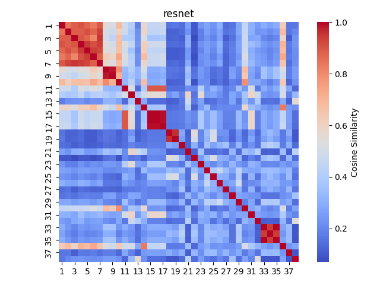

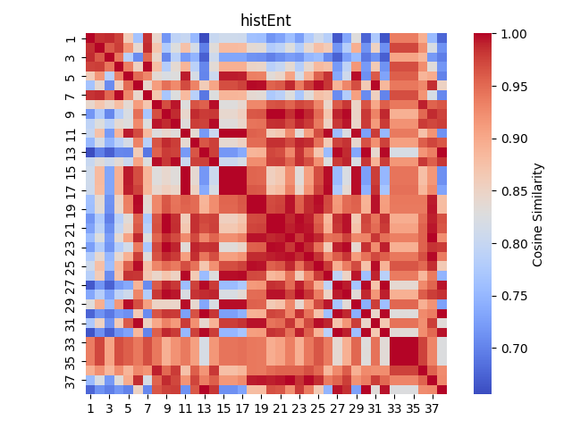

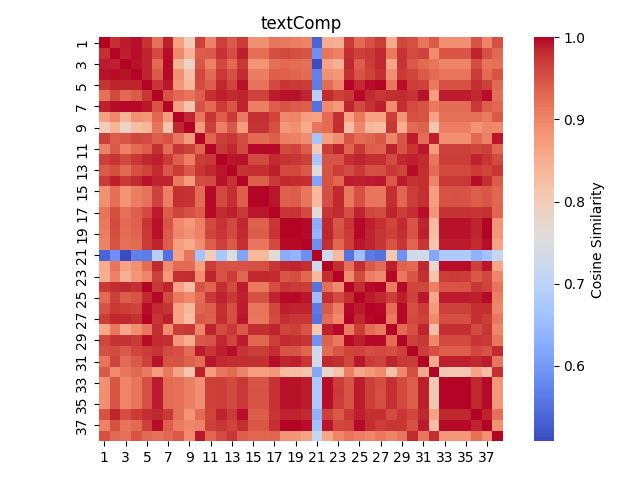

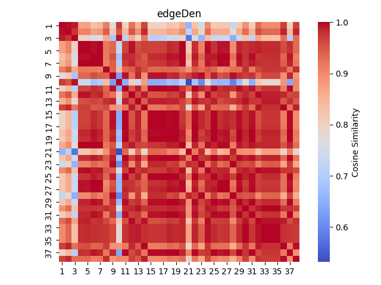

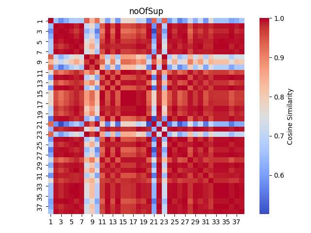

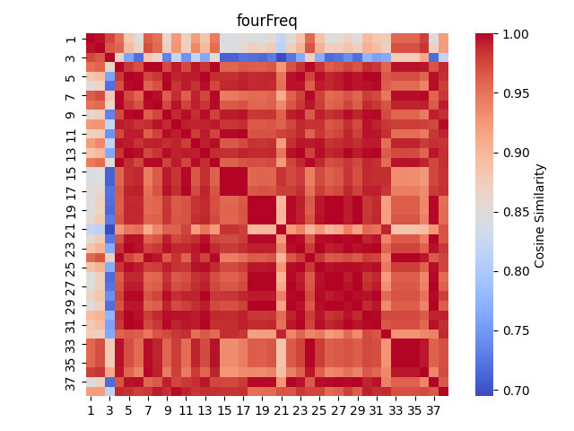

## MEAN Similarity Scatterplots

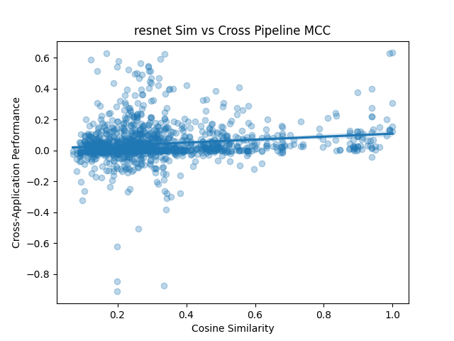

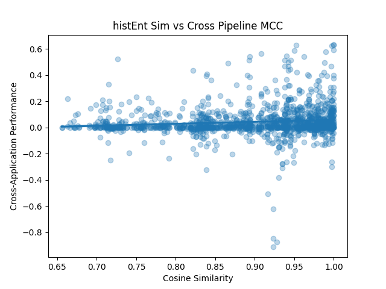

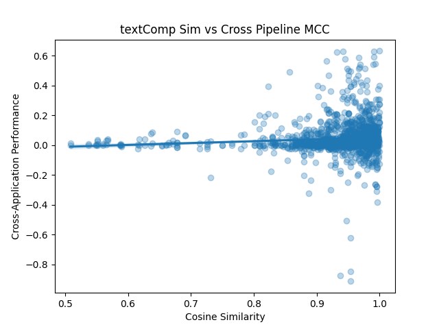

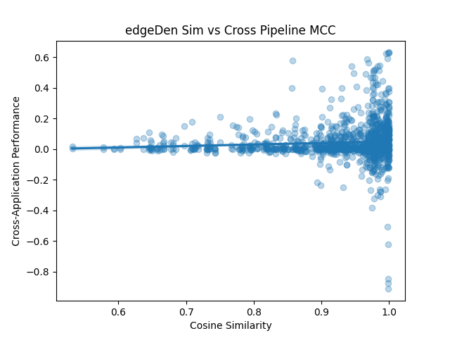

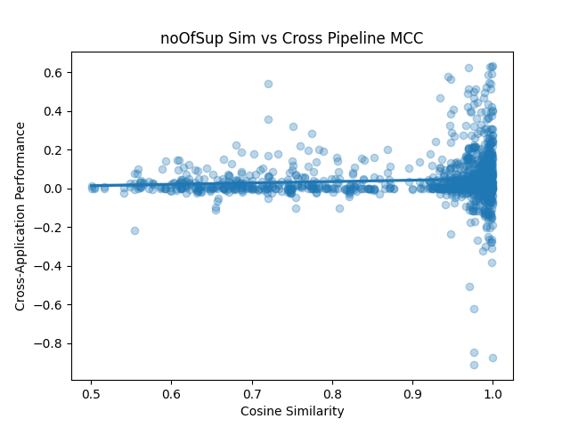

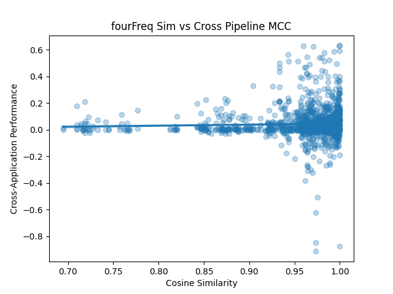

## BEST Similarity Scatterplots

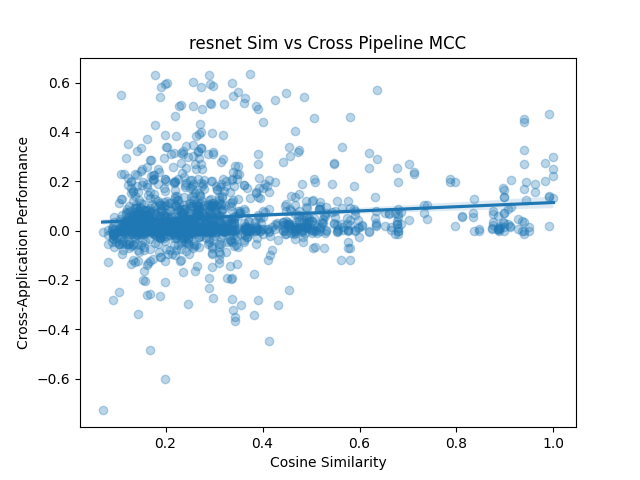

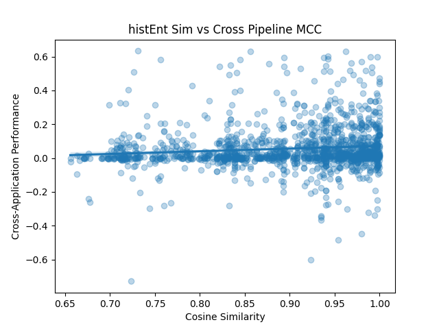

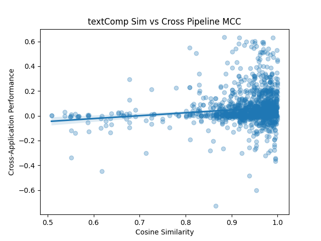

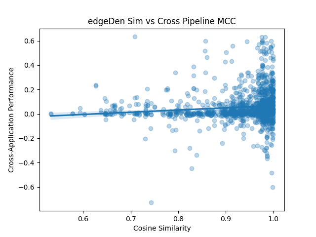

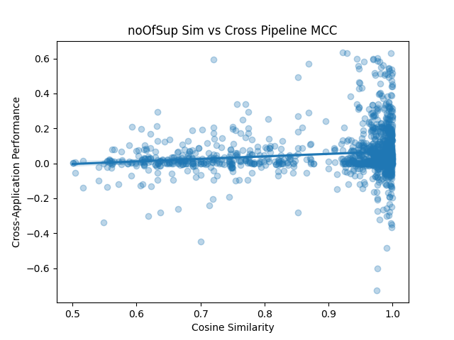

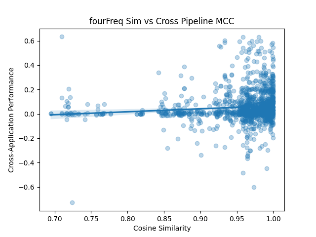
